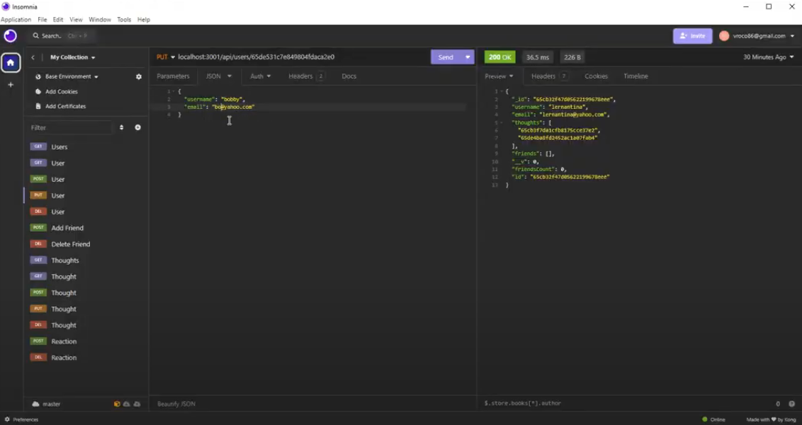

# FriendZoned
  [![license-shield]][license-url]

## Description

This application is social network web based application API where users can add/remove thoughts, add/remove friends, and add/remove reactions to other user's thoughts. Utilizing Express.js and MongoDB database, user's data is stored through the establish model schemas. 

## Table of Contents
  
- [Usage](#usage)
- [Screenshots](#screenshots)
- [Installation](#installation)
- [License](#license)
- [Contributing](#contributing)
- [Questions](#questions)

## Usage
  
[Live Demo walkthrough](https://drive.google.com/file/d/1fASrheBWv4jrzsrVHo6hCFkXX6Spo2Y3/view?pli=1)

<a href='#friendzoned'>back to top</a>

## Screenshots

<a href='#friendzoned'>back to top</a>

## Installation

- To run this project locally, follow these steps:

1. Clone the repository: 

        "$ git clone https://github.com/FractalIceCream/FriendZoned.git"

2. "npm install" from root directory (install packages for both client and server directories as well)

3. "npm start" or "npm run dev" for developer mode

## License
  
This project is licensed under the [MIT License](https://choosealicense.com/licenses/mit)

<a href='#friendzoned'>back to top</a>

## How to Contribute
  
Contribute as needed by forking the repo and making a pull request.
  

<a href='#friendzoned'>back to top</a>

## Questions

[FractalIceCream's GitHub](https://github.com/FractalIceCream)

If you have any questions or feedback, reach me @ [vroco86@gmail.com](mailto:vroco86@gmail.com).

<a href='#friendzoned'>back to top</a>

[license-shield]: https://img.shields.io/badge/LICENSE-MIT-green
[license-url]: https://choosealicense.com/licenses/mit
